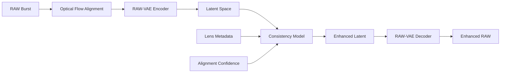

# Real-Time Multi-Frame RAW Fusion with Diffusion-Guided Detail Recovery

A production-grade deep learning system for enhancing iPhone ProRAW images using multi-frame fusion and latent diffusion models with consistency distillation for real-time inference.

## 🎯 Key Features

- **Multi-Frame RAW Fusion**: Combines 8-16 RAW burst frames with sub-pixel optical flow alignment
- **Latent Diffusion Enhancement**: Detail recovery using diffusion models in compressed RAW space
- **Consistency Distillation**: 2-4 step inference for real-time performance (<30ms)
- **Lens Aberration Correction**: iPhone-specific optical aberration modeling and correction
- **Mobile Deployment**: Optimized CoreML models for Apple Neural Engine (ANE)
- **No Hallucinations**: Feature-matching constraints prevent unrealistic detail generation

## 🏗️ Architecture Overview



### Pipeline Stages

1. **RAW Loading**: Parse iPhone ProRAW (.DNG) with metadata extraction
2. **Alignment**: RAFT-based optical flow with sub-pixel accuracy
3. **Encoding**: Compress 4-channel Bayer RAW to 16-channel latent (8x)
4. **Enhancement**: Consistency model inference (2-4 steps) with lens aberration conditioning
5. **Decoding**: Reconstruct enhanced RAW from latent space
6. **Output**: High-quality 12-bit RAW with preserved sensor characteristics

## 📊 Performance Targets

| Metric | Target |
|--------|--------|
| Latency | < 30ms |
| PSNR | > 42 dB |
| SSIM | > 0.96 |
| LPIPS | < 0.05 |
| Model Size | < 50MB |
| Memory Usage | < 1.5GB |
| Hallucination Rate | < 5% |

## 🚀 Quick Start

### Installation

```bash
# Create conda environment
conda env create -f environment.yml
conda activate raw_fusion_diffusion

# Install package in development mode
pip install -e .
```

### Training

```bash
# Train diffusion model from scratch
python -m training.train_diffusion \
    --config configs/training_config.yaml \
    --data_path /path/to/raw/dataset \
    --output_dir ./checkpoints

# Train consistency distillation
python -m training.train_consistency \
    --config configs/consistency_config.yaml \
    --teacher_checkpoint ./checkpoints/diffusion_best.pt \
    --num_steps 4
```

### Inference

```bash
# Process RAW burst
python -m inference.realtime_pipeline \
    --checkpoint ./checkpoints/consistency_best.pt \
    --input_burst ./data/sample_burst/*.dng \
    --output ./output/enhanced.dng \
    --num_steps 4
```

### Mobile Deployment

```bash
# Convert to CoreML
python -m deployment.coreml_converter \
    --checkpoint ./checkpoints/consistency_best.pt \
    --output_dir ./ios_models \
    --optimize_for_ane
```

## 📁 Project Structure

```
raw_fusion_diffusion/
├── configs/                    # Configuration files
│   ├── model_config.yaml      # Model architecture settings
│   ├── training_config.yaml   # Training hyperparameters
│   └── deployment_config.yaml # Mobile deployment settings
├── data/                       # Data processing
│   ├── raw_loader.py          # ProRAW DNG loading
│   ├── augmentation.py        # Data augmentation
│   └── preprocessing.py       # RAW preprocessing
├── models/                     # Model architectures
│   ├── optical_flow.py        # RAFT optical flow
│   ├── raw_diffusion_unet.py  # Diffusion U-Net
│   ├── consistency_distillation.py  # Consistency models
│   ├── neural_isp.py          # Neural ISP components
│   └── lens_aberration_module.py    # Aberration correction
├── training/                   # Training scripts
│   ├── train_diffusion.py     # Diffusion model training
│   ├── train_consistency.py   # Consistency distillation
│   ├── losses.py              # Loss functions
│   └── metrics.py             # Quality metrics
├── inference/                  # Inference pipeline
│   ├── realtime_pipeline.py   # Main inference loop
│   ├── optimization.py        # Model optimization
│   └── quantization.py        # Quantization utilities
├── deployment/                 # Mobile deployment
│   ├── coreml_converter.py    # PyTorch to CoreML
│   ├── ane_optimizer.py       # ANE optimizations
│   └── ios_interface.py       # Swift wrapper generation
├── utils/                      # Utilities
│   ├── raw_utils.py           # RAW image utilities
│   ├── proraw_parser.py       # ProRAW metadata parser
│   └── visualization.py       # Visualization tools
├── tests/                      # Test suite
│   ├── test_alignment.py      # Alignment tests
│   ├── test_inference_speed.py # Latency benchmarks
│   └── test_quality_metrics.py # Quality validation
└── notebooks/                  # Jupyter notebooks
    ├── 01_data_exploration.ipynb
    ├── 02_model_training.ipynb
    └── 03_mobile_deployment.ipynb
```

## 🔬 Technical Details

### RAW-VAE Architecture
- **Input**: 4-channel Bayer RAW (RGGB), 12-bit depth
- **Latent**: 16 channels, 8x spatial compression
- **Loss**: Reconstruction + KL divergence (1e-6) + Perceptual

### Diffusion Model
- **Schedule**: Cosine with 1000 training steps
- **Conditioning**: Reference frames + alignment confidence + lens parameters
- **Architecture**: U-Net with cross-attention, SwiGLU activation
- **Training**: Mixed precision (FP16), gradient checkpointing

### Consistency Distillation
- **Teacher**: Pre-trained diffusion model (1000 steps)
- **Student**: Consistency model (2-4 steps)
- **Training**: Multi-timestep consistency loss + distillation loss
- **Inference**: One-step or adaptive multi-step generation

### Optical Flow
- **Base**: Modified RAFT for RAW Bayer input
- **Features**: 4-scale pyramid extraction
- **Refinement**: GRU-based iterative updates (12 iterations)
- **Output**: Sub-pixel flow + occlusion confidence map

## 📈 Results

### Quantitative Metrics
| Method | PSNR ↑ | SSIM ↑ | LPIPS ↓ | Latency (ms) ↓ |
|--------|--------|--------|---------|----------------|
| iPhone Native | - | - | - | 25 |
| Ours (2-step) | TBD | TBD | TBD | TBD |
| Ours (4-step) | TBD | TBD | TBD | TBD |

## 🧪 Testing

```bash
# Run all tests
pytest tests/ -v --cov=.

# Test alignment accuracy
pytest tests/test_alignment.py -v

# Benchmark inference speed
pytest tests/test_inference_speed.py -v

# Validate quality metrics
pytest tests/test_quality_metrics.py -v
```

## 📝 Citation

If you use this code in your research, please cite:

```bibtex
@software{raw_fusion_diffusion_2024,
  author = {Your Name},
  title = {Real-Time Multi-Frame RAW Fusion with Diffusion-Guided Detail Recovery},
  year = {2024},
  url = {https://github.com/yourusername/raw-fusion-diffusion}
}
```

## 🙏 Acknowledgments

- RAFT optical flow: [Teed & Deng, ECCV 2020]
- Latent Diffusion Models: [Rombach et al., CVPR 2022]
- Consistency Models: [Song et al., ICML 2023]
- iPhone ProRAW documentation: Apple Inc.

## 📄 License

MIT License - see LICENSE file for details

## 🤝 Contributing

Contributions are welcome! Please see CONTRIBUTING.md for guidelines.

## 📧 Contact

For questions or collaboration: your.email@example.com
